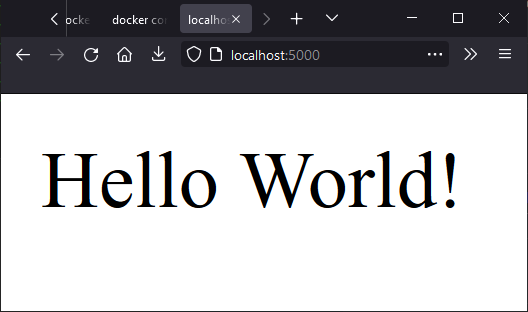

>Student Name: Ritesh Kumar

>Matriculation Number: A0201829H

>[GitHub Repository](https://github.com/rtshkmr/CS3219_assignments/tree/main/taskA/A1_IntroductionToDocker)

# Task A1: Introduction to Docker

## How to Run 

1. from this directory, run `docker compose up`.

## Expected Outcomes

1. Windows systems, the output looks something like this: 

2. Going to localhost:5000 (the configured port for the node application), shows this Hello World message 

## Notes to Self 

[Docker tutorial on github](https://github.com/docker/labs/blob/master/beginner/chapters/setup.md)

### nginx

1. Install instructions for win10 [here](https://www.nginx.com/resources/wiki/start/topics/tutorials/install/#official-win32-binaries)

2. nginx [reverse proxy documentation](https://docs.nginx.com/nginx/admin-guide/web-server/reverse-proxy/)

### Deliverables

1. Reproduced the steps [here](https://ashwin9798.medium.com/nginx-with-docker-and-node-js-a-beginners-guide-434fe1216b6b)

2. Need to group up the nginx and node application contents into two separate subdirs

3. More on how to use [Docker compose](https://docs.docker.com/compose/)

## Random Reading Points

1. [memcached vs Redis](https://aws.amazon.com/elasticache/redis-vs-memcached/) for in memory caching

