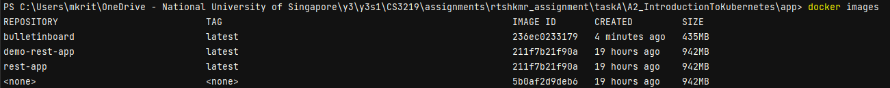
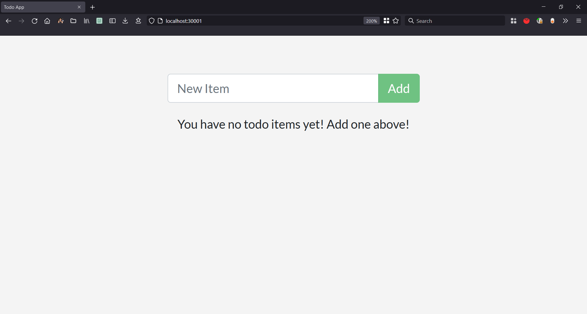

>Student Name: Ritesh Kumar

>Matriculation Number: A0201829H

>[GitHub Repository](https://github.com/rtshkmr/CS3219_assignments/tree/main/taskA/A2_IntroductionToKubernetes)

# A2: Introduction to Kubernetes

## Running Instructions

1. Access this dir, change directory to `/app` where there's a docker compose file
2. Build the local image via `docker image build -t bulletinboard .`. This looks at the `Dockerfile` in app to build an
   image tagged as `bulletinboard`.
    * take note that the image tag here and the image referenced in the kubernetes yaml config must match exactly.  
   To check the image, running `docker images` should show this:  
   
3. (Optional) To test the image, run docker compose up, and you should see the application running at `localhost:4001`.
4. The k8s config file is [`bb.yaml`](./app/bb.yaml), to deploy, use either `minikube` or `docker-desktop` as the deployment node. Here we use `docker-desktop`.
5. Deploy the application via `kubectl apply -f bb.yaml`
6. The Service config sets the node port like so: 
   ```yaml
    apiVersion: v1
        kind: Service
    metadata:
        name: bb-entrypoint
        namespace: default
    spec:
        type: NodePort
        selector:
            bb: web
        ports:
            - port: 3000
              targetPort: 3000
              nodePort: 30001
    ```
   so, from the node's POV, it expects traffic to come in via port `30001`. 
   hence, accessing `localhost:30001` will be enough to see the running application: 
   
7. To check the running pods/deployment/service: 
   ```bash
        PS C:\Users\mkrit\OneDrive - National University of Singapore\y3\y3s1\CS3219\assignments\rtshkmr_assignment\taskA\A2_IntroductionToKubernetes\app> kubectl get pods
        NAME                     READY   STATUS    RESTARTS   AGE
        bb-demo-f7548b87-5hlvl   1/1     Running   0          5s
        bb-demo-f7548b87-nphmt   1/1     Running   0          5s
        bb-demo-f7548b87-thhgs   1/1     Running   0          5s
   ```

## Notes

1. [Kubernetes Concepts](https://kubernetes.io/docs/concepts/overview/)

* Use Cases:
    * framework for distributed systems ; handles scaling and failover for your application, adds deployment patterns
      and
      helps [canary deployment](https://harness.io/blog/continuous-verification/blue-green-canary-deployment-strategies/)

    * can run anything that is containerizable

* What K8s is not:
    * not a CI/CD workflow tool
    * not a mere orchestration system, comprises a set of independent, composable control processes that continuously
      drive the current state towards the provided desired state.

2. [K8s Components](https://kubernetes.io/docs/concepts/overview/components/)

* Pod is a set of containers
* Many Pods = 1 Node
* Many Nodes = 1 Cluster

* See [Control Pane components](https://kubernetes.io/docs/concepts/overview/components/#control-plane-components)
* See [Node components](https://kubernetes.io/docs/concepts/overview/components/#node-components)

3. [K8s API Conventions ](https://github.com/kubernetes/community/blob/master/contributors/devel/sig-architecture/api-conventions.md)
   describes how the API is written and other detailed vocabulary
    * [Required fields ](https://kubernetes.io/docs/concepts/overview/working-with-objects/kubernetes-objects/#required-fields)
      in config `.yaml` file

4. [K8s Service](https://kubernetes.io/docs/concepts/services-networking/service/)

## List of Issues Faced:

1. If using local image that isn't in any registry (DockerHub or smth), there may be an issue in accessing this image
   and hence the Pod will return
   a [ImagePullBackOff](https://stackoverflow.com/questions/34848422/how-to-debug-imagepullbackoff). To fix this so that
   it doesn't bother looking into some registry and instead looks for a local image, can indicate
   the [image pull policy type](https://kubernetes.io/docs/concepts/containers/images/) to `Never`.
2. Note that if there's already a docker compose file, it's possible to use  [**`kompose`**](https://kompose.io/installation/) to generate pod and service configs for the same docker compose file for orchestration.

## [Basic Kubernetes Tutorial](https://kubernetes.io/docs/tutorials/kubernetes-basics/)

1. After creating a cluster using kubectl, we submit a container image for deployment

2. After the deployment is up, to expose the network within the cluster, have to set up a proxy via `kubectl proxy`. An
   alternative to using this proxy would be to setup a K8s service

* a kubectl proxy is a stopgap, a better way to do it is to include
  a [publishing service config](https://kubernetes.io/docs/concepts/services-networking/service/#publishing-services-service-types)

4. A Service in Kubernetes is an abstraction which defines a logical set of Pods and a policy by which to access them.
   Services enable a loose coupling between dependent Pods. A Service is defined using YAML (preferred) or JSON, like
   all Kubernetes objects. Services allow your applications to receive traffic. Services can be exposed in different
   ways by specifying a type in the ServiceSpec. A Service routes traffic across a set of Pods. Services are the
   abstraction that allow pods to die and replicate in Kubernetes without impacting your application. Discovery and
   routing among dependent Pods (such as the frontend and backend components in an application) is handled by Kubernetes
   Services.
## Other Random Takeaways

1. Here's how to [remove a git submodule](https://stackoverflow.com/a/1260982/15357683)

## Acknowledgements

1. Source code taken from the sample repo referenced in the official docker tutorial
   over [here](https://docs.docker.com/get-started/02_our_app/).
    * the repo has been submoduled as docker-tut