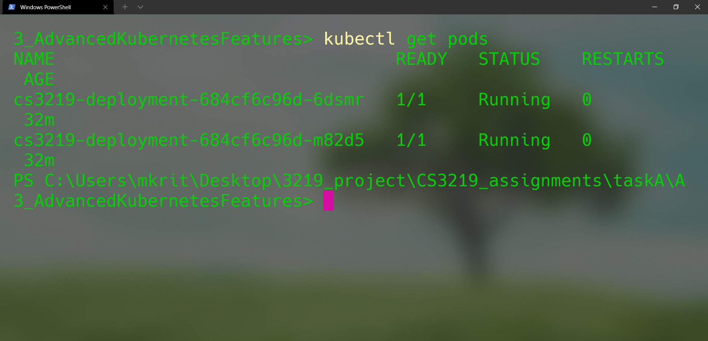
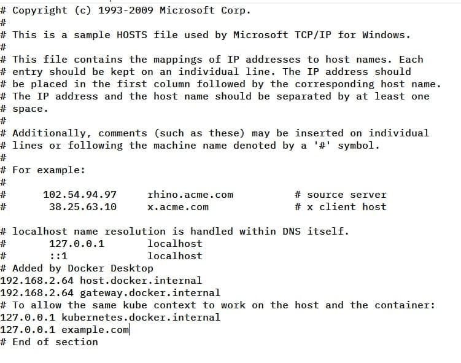
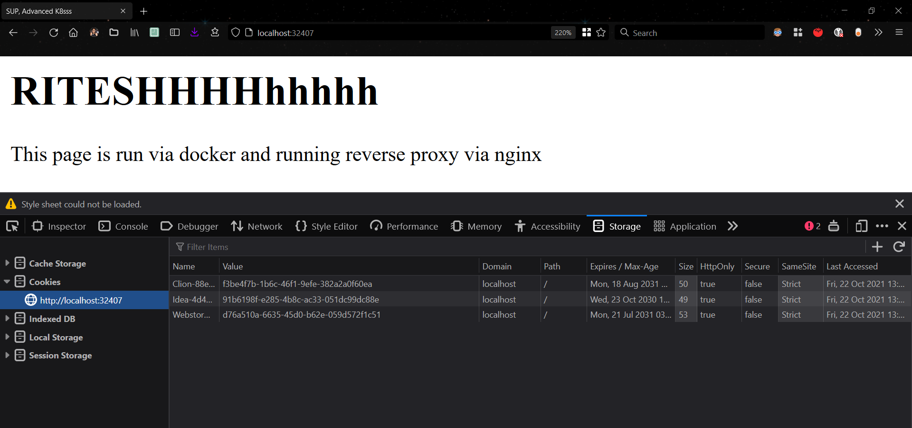
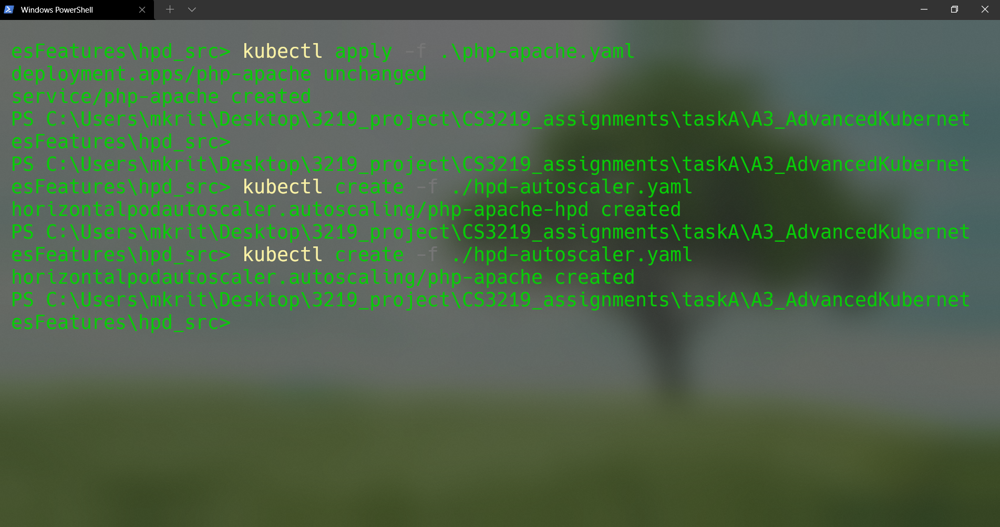
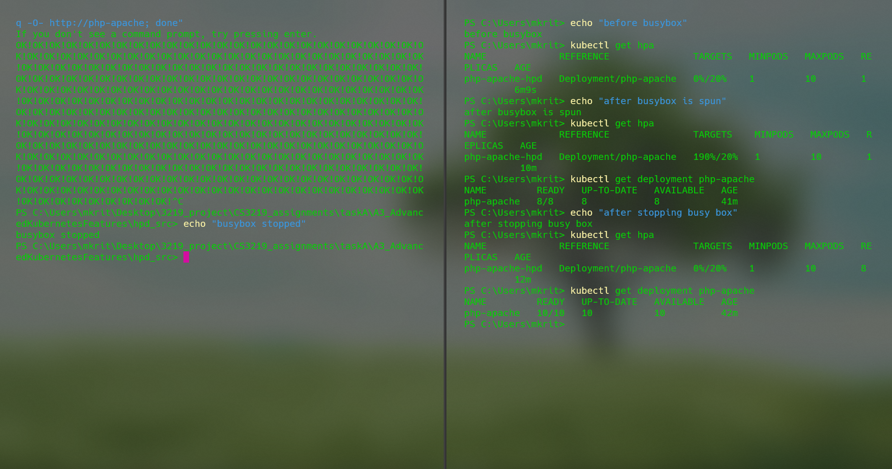

# Task A3: Advanced Kubernetes Features 
>Student Name: Ritesh Kumar

>Matriculation Number: A0201829H

>[GitHub Repository](https://github.com/rtshkmr/CS3219_assignments/tree/main/taskA3_AdvancedKubernetesFeatures)


## Deliverables


### 1. nginx ingress, sticky session

Reference for k8s nginx ingress config can be found [here](https://kubernetes.github.io/ingress-nginx/deploy/)

1. A simple html static page, along with a config file is [here](./nginx)
2. Build the image, then apply the deployment config file found in this sub-project root like so: 
   ```bash
   kubectl apply -f .\nginx-deployment.yaml # apply deployment
   ```
   we can verify via a `kubectl get pods` to see that 2 pods are up:
   
3. Now, apply the service file followed by the ingress config:
   ```bash 
   kubectl apply -f .\nginx-service.yaml # apply service for internal networking
   kubectl apply -f https://raw.githubusercontent.com/kubernetes/ingress-nginx/controller-v0.49.0/deploy/static/provider/cloud/deploy.yaml #controller from reference
   kubectl apply -f ./nginx-ingress.yaml # apply the ingress config
   ```
   This will allow us to locate the static page over at `localhost:32407`

4. Add the example url as host in the appropriate host file. For windows, it's at `C:\Windows\System32\drivers\etc\hosts`. This action needs to be done as sudo. 
   Here's mine after adding: 
5. Via the browser, the existing cookies can be seen to persist, hence are sticky despite refreshes
   


# 2. Horizontal Autoscaling 

Following the official tutorial, we deploy a php image, then deploy a custom 
autoscaler declaration and then run a busybox to see it in action. 

Run the following commands from within the [`/hpd_src`](./hpd_src) subdir

1. build php image: `docker build -t php-apache -f ./Dockerfile .`
2. apply the php config (i.e. the deployment and service config)
   `kubectl apply ./php-apache.yaml`
3. deploy the metrics server.
   `kubectl apply -f .\metrics.yaml # seems like metrics are needed for getting target load metrics`
   It seems that the current load on the pod won't be visible without the metric server (as per [this](https://stackoverflow.com/questions/66859090/kubernetes-metrics-server-api?noredirect=1) StackOverflow post).
4. Apply the custom autoscaler: 
   `kubectl apply -f ./hpd-autoscaler.yaml`
   
   For this, I've set the utilization metric to a custom value of 20%.
5. Spin off busybox to simulate stress
   `kubectl run -i --tty load-generator --rm --image=busybox --restart=Never -- /bin/sh -c "while sleep 0.01; do wget -q -O- http://php-apache; done"`
6. Observe hpa status before, during and after the running of busybox via `kubectl get hpa`
   Here is a screenshot of what is expected behaviour: 


> primary resources used: [Official K8s Tutorials](https://kubernetes.io/docs/tasks/run-application/horizontal-pod-autoscale-walkthrough/)