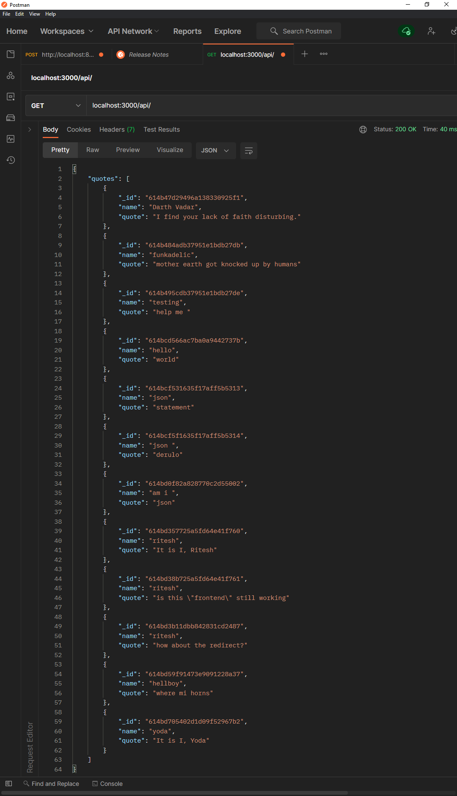
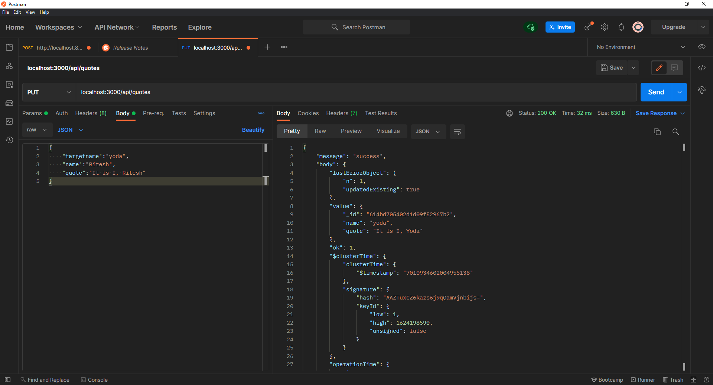
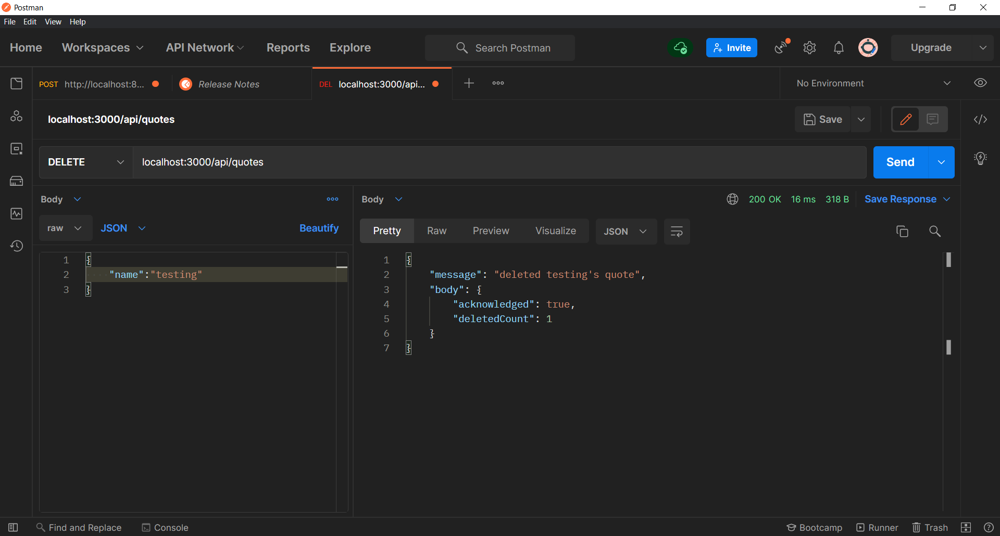
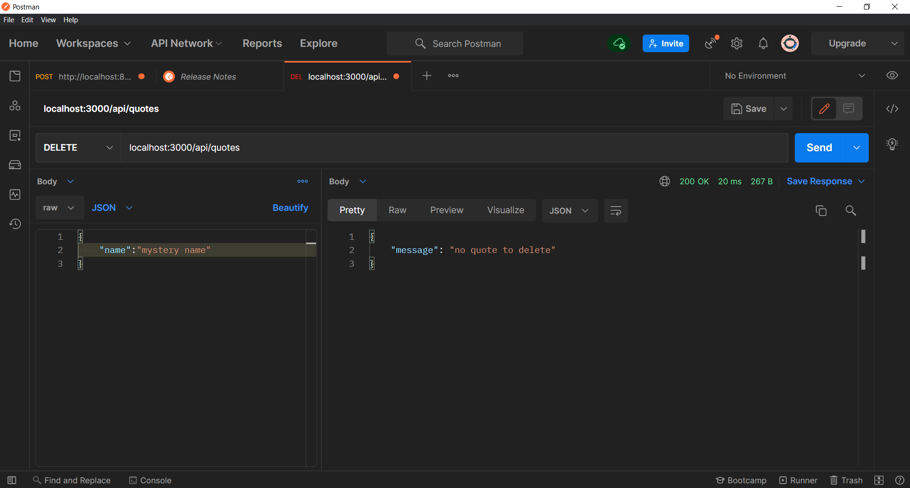
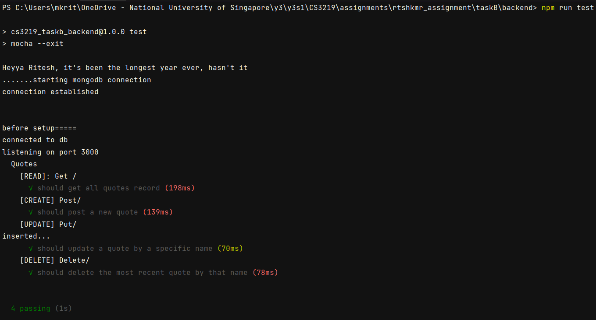
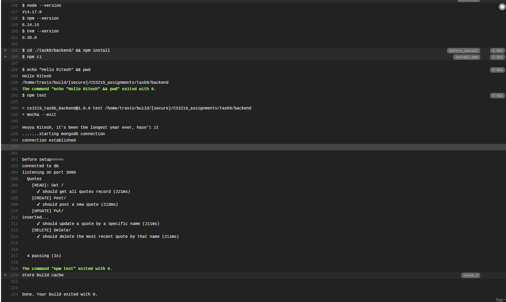

# B: A simple CRUD Application

## B1: A simple backend

Reference: using [this blog post ](https://zellwk.com/blog/crud-express-mongodb/) about a very basic ME(R)N application
that churns out quotes. Will mod it to some other pop culture reference I guess.

### CRUD Actions via API endpoints

**Note: db is hosted at MongoDB Cloud Atlas**
1. Create Quotes:
    1. localhost:
       
    2. deployed: todo

2. Read Quotes:
    1. localhost:
       
    2. deployed: todo

3. Update Quotes:
    1. localhost:
       
    2. deployed: todo
4. Delete Quotes:
    1. localhost:
       
    2. deployed: todo

### Basic edge cases: 

1. Deleting something that isn't there: 
   
2. 

**Takeaways: **

1. How express uses middleware via [the .use function](https://stackoverflow.com/a/11321828/15357683)

2. [Mongodb installation](https://docs.mongodb.com/manual/tutorial/install-mongodb-on-windows/). hate windows for this.

* To connect to your local MongoDB, you set Hostname to localhost and Port to 27017.

## B2: Testing via CI

### MochaJS

pointers on usage:
1. Mocha discovers test files; when given no files or directories, it finds files with extensions .js, .mjs or .cjs in the test directory (but not its children), relative to the current working directory ==> can't store it in subdirs and need to be in working dir

2. try not to use lambda functions because of environment scoping issues [see this](https://mochajs.org/#arrow-functions)

### Chai

* an assertion library to work together with your testing framework
* has three assertion styles: as usual assert style, as an expect style or should style of defining assertions

### Deliverables:

1. [How to test](https://stackoverflow.com/a/55327121/15357683) when there's a mongo client being applied to your server application (and hence the server application would complain if you just pass in an export keyword)

2. Local testing:
   How to run test:
   1. navigate to [taskB/backend](/taskB/backend) directory and via cli, run `npm test` to get the following test output:
   

3. Travis CI testing, [see log here](https://app.travis-ci.com/github/rtshkmr/CS3219_assignments/builds/238360933).
   Config file can be found here [Travis CI Config File](../.travis.yml)
   
4. 

### Issues Faced:

1. for some reason, the http server persisted after tests (i.e. mocha doesn't cause the server to kill itself once done). [Here's a workaround](https://github.com/chaijs/chai-http/issues/178)

Followed the adding of `mocha --exit` to the test script instead, the other solutions didn't work :( 

