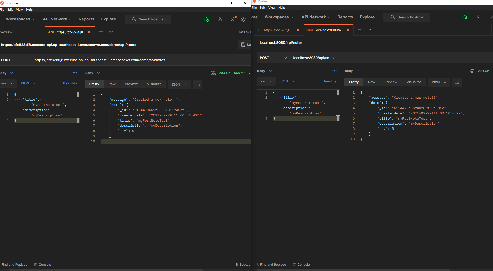
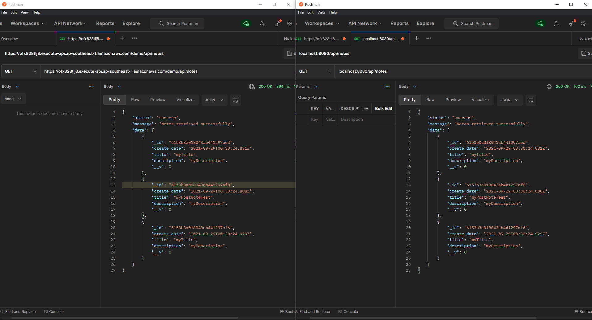
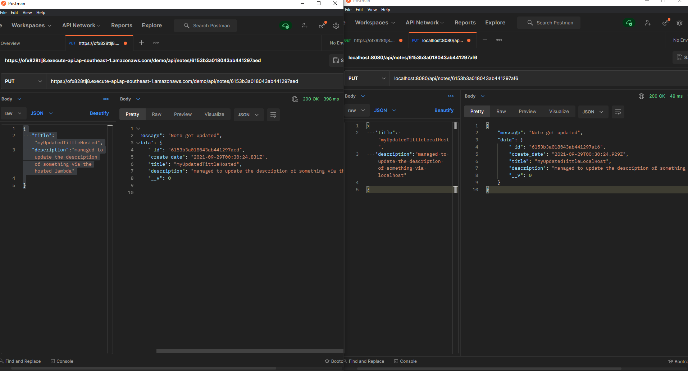
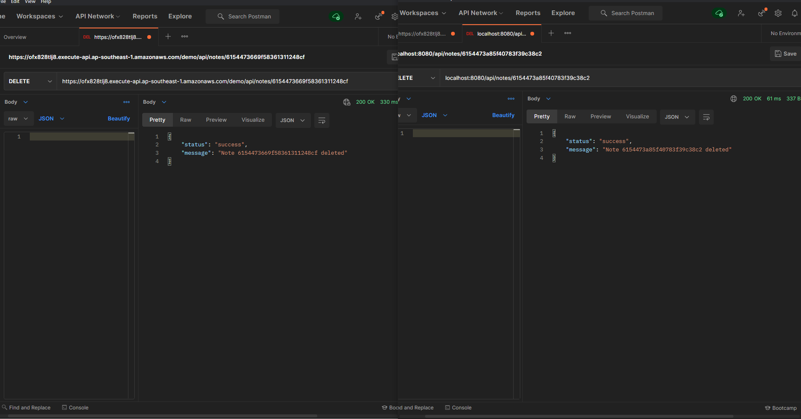
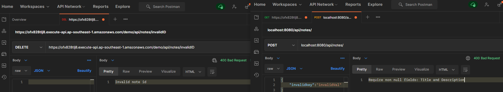
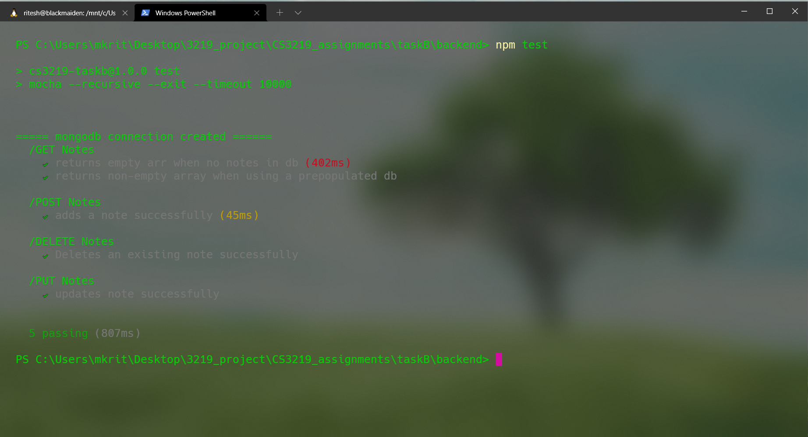
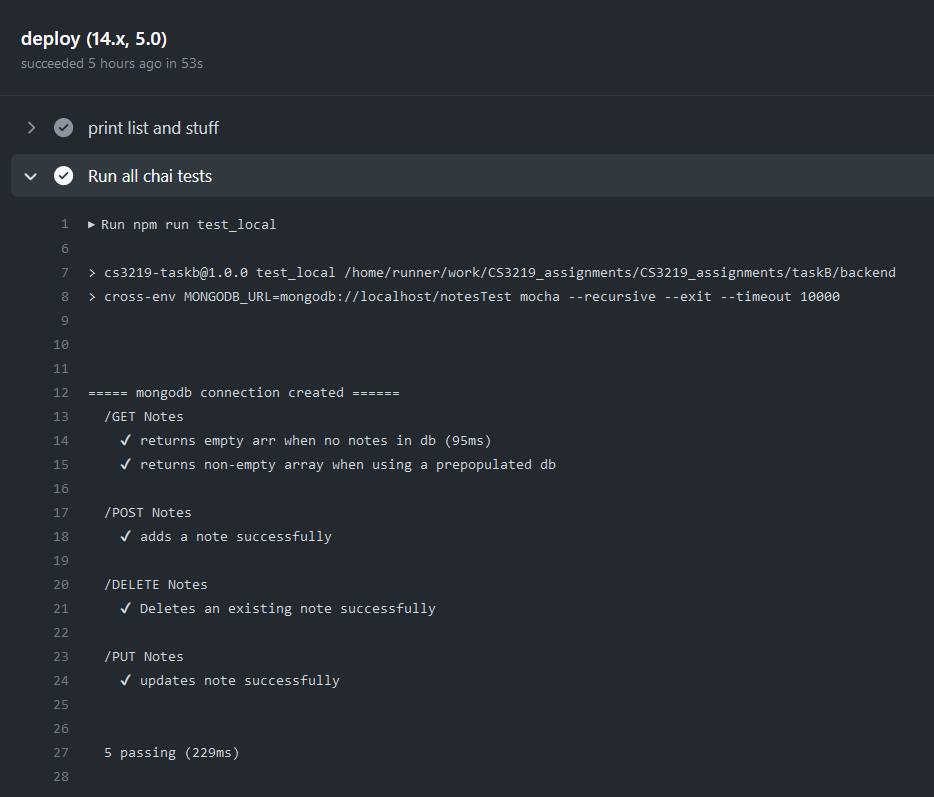
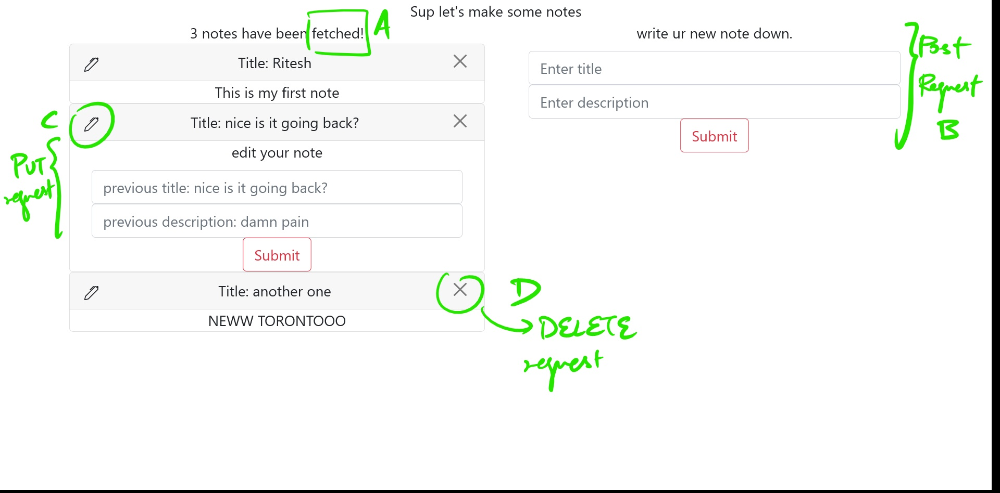

>Student Name: Ritesh Kumar

>Matriculation Number: A0201829H

>[GitHub Repository](https://github.com/rtshkmr/CS3219_assignments/tree/main/taskB)

# B: A simple CRUD Application

## B1: A simple backend

Reference: using this [notes tutorial](https://www.sitepoint.com/a-guide-to-serverless-deployment-with-express-and-mongodb/)

### CRUD Actions via API endpoints

**Note: db is hosted at MongoDB Cloud Atlas, API gateway is over at [here](https://ofx828tlj8.execute-api.ap-southeast-1.amazonaws.com/demo/)**

_The following screenshots show behaviour on deployed api (left) and localhost(right)_

1. Create Notes:

2. Read Notes:

3. Update Notes:

4. Delete Notes:

### Basic edge cases: 

On the left, deleting something that isn't there, 
on the right, posting something without required object structure.

**Takeaways: **

1. How express uses middleware via [the .use function](https://stackoverflow.com/a/11321828/15357683)

2. [Mongodb installation](https://docs.mongodb.com/manual/tutorial/install-mongodb-on-windows/). hate windows for this.

* To connect to your local MongoDB, you set Hostname to localhost and Port to 27017.

## B2: Testing via CI

### MochaJS

pointers on usage:
1. Mocha discovers test files; when given no files or directories, it finds files with extensions .js, .mjs or .cjs in the test directory (but not its children), relative to the current working directory ==> can't store it in subdirs and need to be in working dir

2. try not to use lambda functions because of environment scoping issues [see this](https://mochajs.org/#arrow-functions)

### Chai

* an assertion library to work together with your testing framework
* has three assertion styles: as usual assert style, as an expect style or should style of defining assertions

### GitHub Actions:

1. Uses doesn't use the working directory
2. Uses and run can't be tgt in the same step 
3. Zipping is a pain, have to set the destination as the same directory as the contents (and don't zip the entire folder, zip its contents instead). Can check by exporting the lambda deployment files!

### Deliverables:

1. [How to test](https://stackoverflow.com/a/55327121/15357683) when there's a mongo client being applied to your server application (and hence the server application would complain if you just pass in an export keyword)

2. How to conduct testing:
   1. **Locally**, navigate to [taskB/backend](/taskB/backend) directory and via cli, run `npm test` to get the following test output:
   
   2. Via CI, following the deployment script [here](../.github/workflows/backend_deploy.yml), gives us a similar github runner output
   . Here's a [link to the job](xxx)
3. 

### Issues Faced:

1. for some reason, the http server persisted after tests (i.e. mocha doesn't cause the server to kill itself once done). [Here's a workaround](https://github.com/chaijs/chai-http/issues/178)

Followed the adding of `mocha --exit` to the test script instead, the other solutions didn't work :( 

2. Was homicidal after trying out Travis. Eventually got it working but somehow couldn't get the API gateway ==> Lambda right
   1. ended up just redoing everything and using github actions (and a simpler example tutorial)

## B3 - Deployment through Continuous Deployment

Figured out travis [over at this branch](https://github.com/rtshkmr/CS3219_assignments/tree/B/deployment), but
couldn't get the API gateway working. Even managed to setup the Lambda and see logs that imply it works. 
Anyway, ended up purging the whole thing and restarting.

### [Backend API Endpoint](https://ofx828tlj8.execute-api.ap-southeast-1.amazonaws.com/demo/api/)

## B4 - Frontend Implementation

A simple react app that calls all the API endpoints. It uses ReactBootstrap for styled components.
This annotated screenshot shows the interactions, the app is basic and intuitive.

### Running Instructions
In the [project directory](./frontend), you can run:

### `npm start`

Runs the app in the development mode.\
Open [http://localhost:3000](http://localhost:3000) to view it in the browser.

The page will reload if you make edits.\
You will also see any lint errors in the console.

