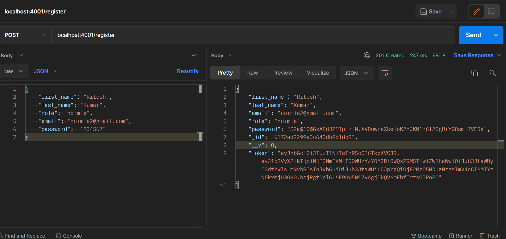

# Task C: Authentication and Authorization
>Student Name: Ritesh Kumar

>Matriculation Number: A0201829H

>[GitHub Repository](https://github.com/rtshkmr/CS3219_assignments/tree/main/taskC)

## Deliverables

1. Registering users to get tokens: 
   1. Registering a Normie: 
   2. Registering a VIP: 
2. Login normie: 
3. Unauthenticated Access for normie: 
4. With token, access for normie:  
5. Unauthorized access (normie trying to enter lounge): 
6. Authorized Access (VIP trying to enter lounge): 

Just like VIP, other roles can be added. 
