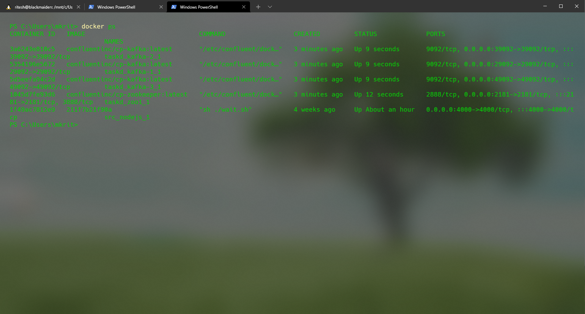
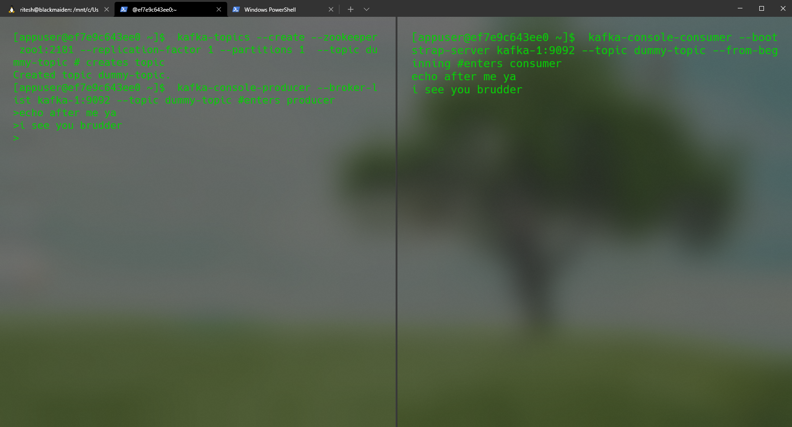
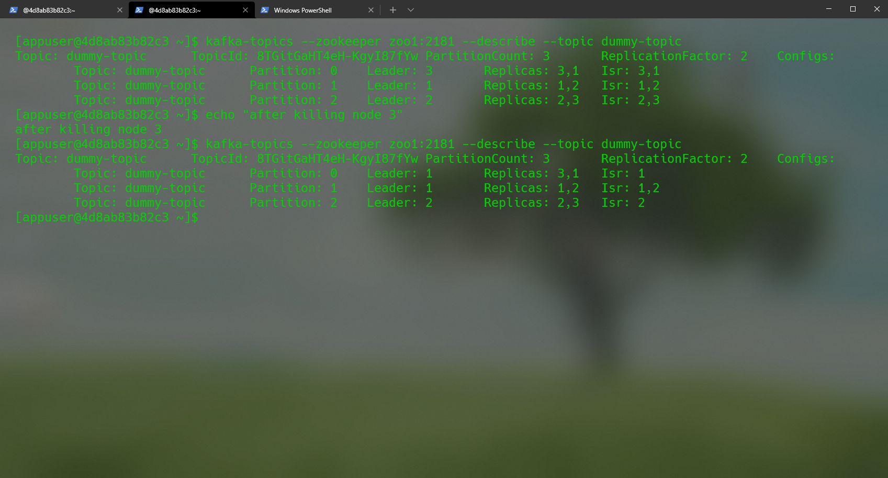
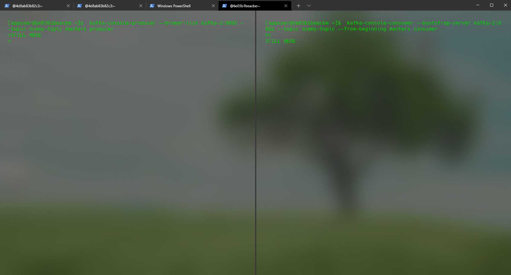

# Task D: Pub-Sub Messaging via Kafka
>Student Name: Ritesh Kumar

>Matriculation Number: A0201829H

>[GitHub Repository](https://github.com/rtshkmr/CS3219_assignments/tree/main/taskD)

## Background

0. Kafka is the message broker, groups messages into topics and handles topics. Both pub and sub can be done
    * here's
      a [thorough introduction to kafka](https://hackernoon.com/thorough-introduction-to-apache-kafka-6fbf2989bbc1)

1. Kafka ZooKeeper.
    * here's a [primer on it](https://medium.com/rahasak/kafka-and-zookeeper-with-docker-65cff2c2c34f)

## Deliverables

The configuration for the servers is at [here](./docker-compose.yml). This indicates the configuration for a single
zookeeper and 3 kafka nodes.

### Simple Pub-Sub

1. Spin up the servers via `docker-compose up` (I prefer to open up non-detached instance docker so that the logs can be
   easily seen). Verify that the container is up by running `docker ps` to see this output:
   
2. Now we enter one of the nodes in order to carry out actions within it:
    1. `docker exec -it taskd_kafka-1_1 bash` interactively spawns a bash shell within that node.

3. Create a dummy topic like so:

    ```bash
    kafka-topics --create --zookeeper zoo1:2181 --replication-factor 2 --partitions 3  --topic dummy-topic # creates topic
    # output: Created topic dummy-topic.
    ```
   This creates a topic which can be produced to and consumed from.

4. Now, produce a message to the `dummy-topic`:
    1. Enter the producer console in order to publish messages to that topic:
       ```bash
       kafka-console-producer --broker-list kafka-1:9092 --topic dummy-topic #enters producer
       ```
    2. On a separete shell, enter the consumer console in order to consume messages from that topic:
       ```bash
       kafka-console-consumer --bootstrap-server kafka1:9092 --topic dummy-topic --from-beginning
       ```
    3. type any message in the produce and see it appear in the consumer terminal:
       

#### Failover Demo



1. Run `kafka-topics --zookeeper zoo1:2181 --describe --topic dummy-topic` to see the current description of the topic,
   which shows the master node
2. Kill the Leader node:
    1. in the host shell, run `docker container kill taskd_kafka-3_1`
    2. here (node 3) will change the state like in the screenshot above, allocating other nodes.
3. The pub-sub functionality still works if we use another node:
    1. 


