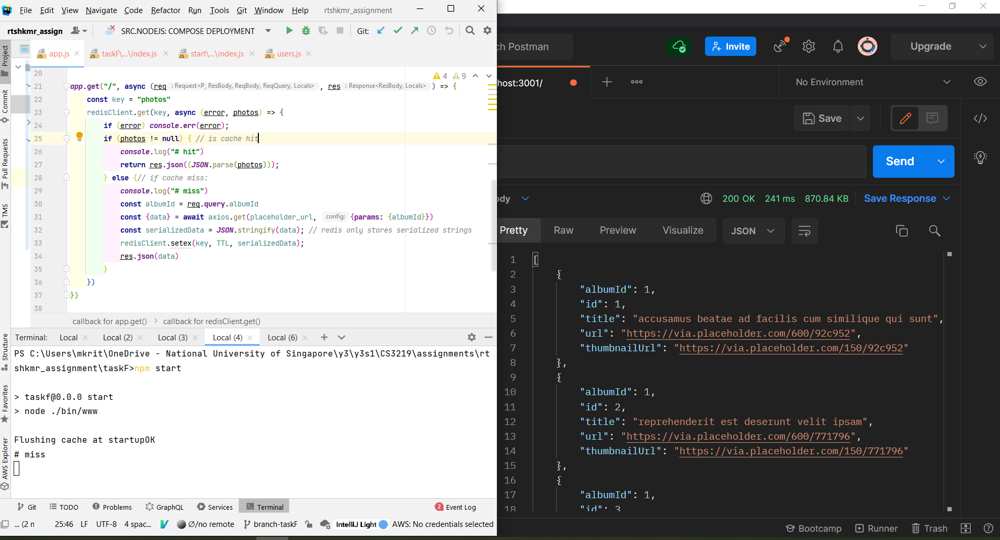
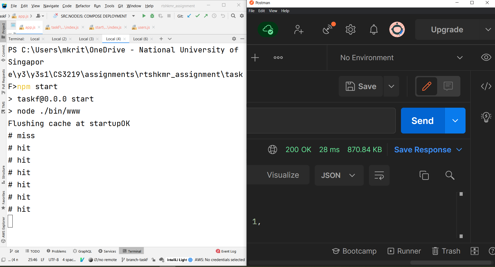

# F: Caching Task

## Task Fulfillment

1. Following demo-code running on a boilerplate express server:
```javascript
app.get("/", async (req, res) => {
    const key = "photos"
    redisClient.get(key, async (error, photos) => {
        if (error) console.err(error);
        if (photos != null) { // is cache hit
            console.log("# hit")
            return res.json((JSON.parse(photos)));
        } else {// if cache miss:
            console.log("# miss")
            const albumId = req.query.albumId
            const {data} = await axios.get(placeholder_url, {params: {albumId}})
            const serializedData = JSON.stringify(data); // redis only stores serialized strings
            redisClient.setex(key, TTL, serializedData);
            res.json(data)
        }
    })
})
```
2. Upon first call to that endpoint, we get the following cache miss with a **response time of 241 ms**: 
   
3. Subsequently, calls to the same endpoint will have cache hits, **reducing the response time to as low as 28ms** 
   

## Notes

### [Primer on Caching](https://medium.datadriveninvestor.com/all-things-caching-use-cases-benefits-strategies-choosing-a-caching-technology-exploring-fa6c1f2e93aa):

1. Noteworthy use cases:
* RDBMS speedup, having external caching can help improve performance
* Session Store: caching of data within active web sessions

2. Caching Data Access Strategies/Policies (like in CS2106) :
   System design depends on data access strategies
* Lazy Loading/ReadThru
* Write thru
* **Write Behind Caching**: write to cache and after an interval asynchronously sync the db via the cache -> _**suitable for high read & write throughput system**_

3. Caching Strategy:
* Single Node (in process) caching: for non-distributed systems

### Memcached

1. Simple key value store where the key is a string and the value is an object that is **stored in serialized form**

2. if distributed, nodes don't talk to one another.

3. It's entirely in-memory and there's no persistence of the cache.

3. Eviction Policy: only supports LRU.   
   **Suitable Usecases:** Store simple string key / value pairs. Store database resultset object, HTTP api response, or serializable in-memory objects, JSON / XML document as value with a string key, results of page rendering etc.

### Redis

1. Supports native mutable data structures namely — list, set, sorted set, string, hash. It also supports range queries, bitmap, hyperloglogs, geo-spatial indexes with radius queries..

#### [Redis use case ](https://redislabs.com/solutions/use-cases/)

Suitable Usecases: Redis has many many lucrative use cases:

1.  Redis hash can be used in place of relational tables if you can model your data accordingly & your use cases don’t require any transactional guarantee.

2. Redis pub-sub can be used to broad cast messages to multiple subscribers.

3. Redis list can be used as queue of messages. Celery — a distributed task processing system leverages redis data structures to manage tasks.

4. Session store is a very popular use case for redis. Persistent ability of redis makes it suitable for such case.

5.  Redis sorted sets can be used to manage leader boards in online gaming.

6. Redis can store, increment, decrement integers. It can be used to generate global id for any use cases.


# Redis

1. Everything is stored as a string, regardless if other input datatypes or not
2. can set ttl for every entry, set via `setex`
3. For arrays and stuff, the adding to the front or end is done via left- and right- prefixed commands e.g. `lpush`
4. Hashes can only have a single level of nesting so no hash of hash...


* [Windows Install Instructions for redis (uses WSL2)](https://stackoverflow.com/questions/6476945/how-do-i-run-redis-on-windows/58853971#58853971). Official guide is [here](https://redis.com/blog/redis-on-windows-10/).