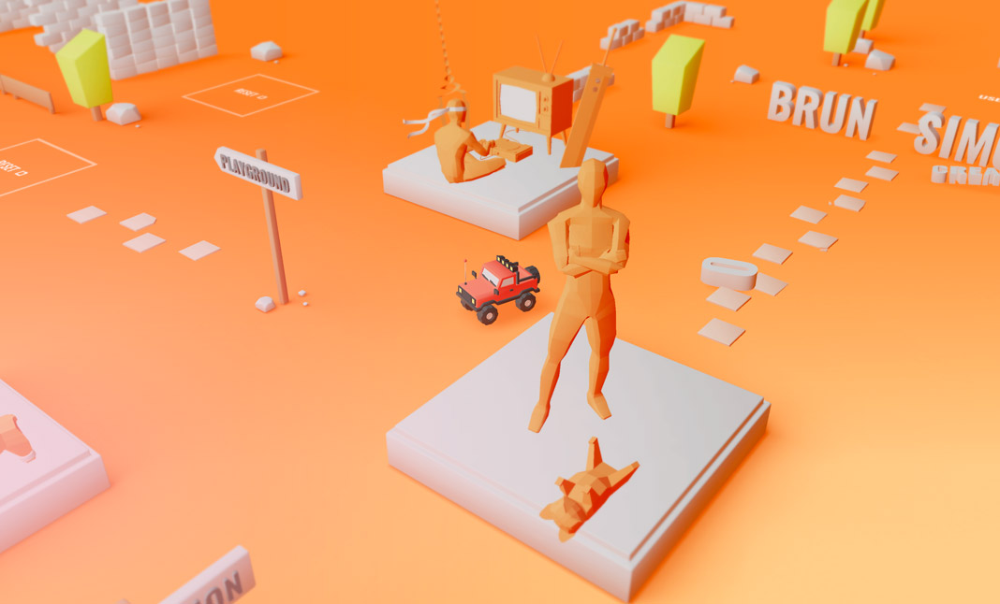

>Student Name: Ritesh Kumar

>Matriculation Number: A0201829H

>[GitHub Repository](https://github.com/rtshkmr/CS3219_assignments/tree/main/taskG)

# Module Content Enhancement Task

For this task, I'm suggesting an additional topic to be covered in the module:   
**Incorporting Vector Graphics / 3D Object Visualisation Frameworks**. 

## Motivation 

Modern 3D graphics rendering has improved a lot from 2006, when WebGL was first introduced to display vector objects directly onto browsers. Today, there are many existing open source frameworks that build onto WebGL and provide rich features to make interactive websites. A good bulk of the portfolio projects that go viral in common CS and software-specific subreddits like `r/webdev` for example, generally have some interactive elements to them. Two prominent examples from 2 years ago can be [Bruno Simon's portfolio website](https://bruno-simon.com/) as well as [this site](https://theyearofgreta.com/) dedicated to Greta Thunberg's work and journey. 

These sites made libraries like [Three.js](https://threejs.org/) all the rage.

Similarly, the use of graphics libraries have seen more popularity for unique interactive visualisations as well. Uber's [Deck.GL](https://deck.gl/) helps developers easily render Geospatial Visualisations, for example.

These frameworks are **easy to pick up**, are built to *interface with common frontend frameworks like ReactJS* and also provide a good opporunity to learn foundational graphics concepts without delving too deep into Computer Graphics. 
Additonally, it also allows students to make beatiful front end applications that stand out. 

## Possible Pedagogy

As with learning most new technologies in Computing, learning independently via guided tutorials from official sources and going at it via a sandboxed-playground first approach is ideal. The existing style of how the OTOT Tasks have been done would be ideal for such a topic as well. 

There's one caveat: that having some basic Computer Graphics concepts would allow developers to pick up these frameworks and libraries much faster. Hence, this topic could be split into at least two parts:
1. WebGL foundations:  
   * there are a lot of resources on this, and covering sections 1 to 5 of the [traditional WebGl documentation](https://learnwebgl.brown37.net/) is an ideal primer for this. These can serve to be (somewhat optional) reading assignments instead of making students replicate the depth of the content that is presented in these.   

2. Using the [three.js getting started tutorials](https://threejs.org/docs/#manual/en/introduction/Creating-a-scene) to render a simple scene and 3D object of choice into a front end component to demonstrate the ability to utilize these frameworks.

## Possible Assessment: 

1. Basic Marks to just show demonstration of the basic Graphics Concepts shown via the task 2 above
2. Possible extension marks for high-effort demo projects. 

This marking scheme would be pretty much the same as the existing marking scheme for the OTOT tasks. Personally, the pedagogy for the OTOT tasks so far have been very useful in helping us students pick up necessary skills. 

## Possible Issues
* While Graphics is definitely a very complex field, the goal is not to mirror the Intro to Grpahics mod. Rather, this topic would be a good opportunity for students to learn how to use frameworks that abstract away deeply complex areas of computing and be skilled at incorporating these rich interactive aspects to this 

## Alternatives 

Really, incorporating any kind of complex frameworks is a good skill to have. Alternatives could be the rendering of Data Visualisation libraries could be another useful aspect to consider since many beginner-friendly internships seem to revolve around creating visualisation dashboards. 

